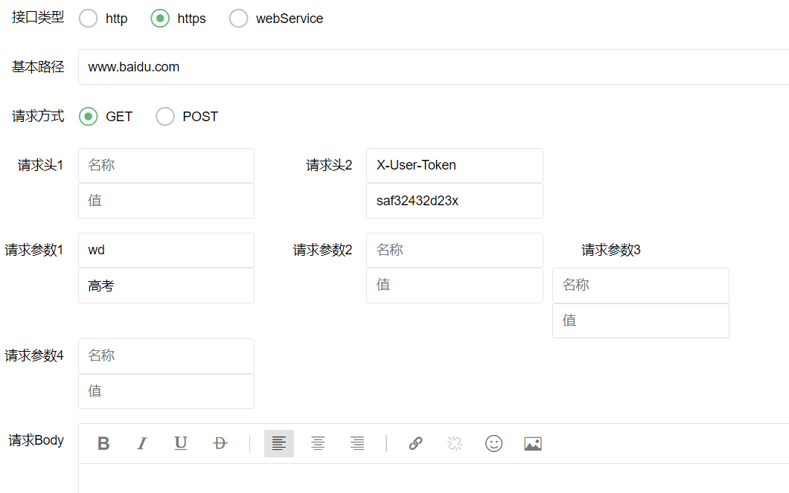

### Rest-Assured测试框架验证

#### Rest-Assured简介

Rest-Assured 是一个测试 RESTful Web Services 的 Java 类库。可以使用 Rest-Assured 编写高度自定义化的 HTTP 请求用来测试各种各样 Restful 服务组合的业务实现。

Rest-Assured 同样能够验证从服务器返回的 HTTP 响应报文，例如服务器响应状态码，响应报文内容等，Rest-Assured 可以灵活的用来进行 Restful Webservice 测试。

#### Http协议请求测试 

##### 模拟测试的接口（返回JSON）

```java
	/**
     * HttpGet请求无参测试
     */
    @GetMapping("httpGet")
    public JsonBean httpGet() {
        return new JsonBean(0, "OK", null);
    }
    /**
     * HttpGet请求Query参数测试
     */
    @GetMapping("httpGetParams")
    public JsonBean httpGetParams(String username,String password){
        return new JsonBean(0,"OK",null);
    }
    /**
     * HttpGet请求Headers参数测试
     */
    @GetMapping("httpGetHeaders")
    public JsonBean httpGetParamsHeaders(String username, String password, HttpServletRequest request){
        return new JsonBean(0,"OK",request.getHeader("X-User-Token"));
    }
    /**
     * HttpPost请求Body参数测试
     */
    @PostMapping("httpPostBody")
    public JsonBean httpPostBody(@RequestBody DTO dto){
        return new JsonBean(0,"OK",dto);
    }
```

##### GET请求

- **无参数测试**

  **待测接口信息**

  ```json
  {
      "路径":"127.0.0.1:8080/devops/test/httpGet",
      "请求方式":"GET",
      "返回体":"json格式"
  }
  ```

  

  **正常测试返回**

  ```wiki
  HTTP/1.1 200 
  Content-Type: application/json;charset=UTF-8
  Transfer-Encoding: chunked
  Date: Mon, 27 Jul 2020 06:38:43 GMT
  Keep-Alive: timeout=60
  Connection: keep-alive
  
  {
      "code": 0,
      "msg": "OK",
      "data": null
  }
  ```

  **服务器连接异常**

  ```wiki
  java.net.ConnectException: Connection refused: connect
  ```

  **路径不存在返回**

  ```wiki
  HTTP/1.1 404 
  Content-Type: application/json;charset=UTF-8
  Transfer-Encoding: chunked
  Date: Mon, 27 Jul 2020 06:41:17 GMT
  Keep-Alive: timeout=60
  Connection: keep-alive
  
  {
      "timestamp": "2020-07-27T06:41:17.463+0000",
      "status": 404,
      "error": "Not Found",
      "message": "No message available",
      "path": "/devops/test/httpXXX"
  }
  ```

- **Query参数测试**

  **待测接口信息**

  ```json
  {
      "路径":"127.0.0.1:8080/devops/test/httpGetParams",
      "请求方式":"GET",
      "返回体":"json格式",
      "请求参数":"username=zs,password=123"
  }
  ```

  

  **测试结果**

  ```
  可行
  ```

- **请求头参数测试**

  **待测接口信息**

  ```json
  {
      "路径":"127.0.0.1:8080/devops/test/httpGetHeaders",
      "请求方式":"GET",
      "返回体":"json格式",
      "请求头":"X-User-Token=zs,Content-Type=application/json",
  }
  ```

  **测试结果**

  ```wiki
  Request method:	GET
  Request URI:	http://127.0.0.1:8080/devops/test/httpGetHeaders?password=123456&username=zs
  Query params:	password=123456
  				username=zs
  Headers:		X-User-Token=dw1q123da3sa4x
  				Accept=*/*
  				Content-Type=application/json; charset=UTF-8
  {
      "code": 0,
      "msg": "OK",
      "data": null
  }
  ```

##### POST请求

- **请求Body测试**

  **接口信息**

  ```json
  {
      "路径":"127.0.0.1:8080/devops/test/httpPostBody",
      "请求方式":"POST",
      "返回体":"json格式",
      "请求Body":"{"title":"hello","num":"1"}"
  }
  ```

  

  **返回信息**
  
  ```wiki
  Request method:	POST
  Request URI:	http://127.0.0.1:8080/devops/test/httpPostBody
  Proxy:			<none>
  Request params:	<none>
  Query params:	<none>
  Form params:	<none>
  Path params:	<none>
  Headers:		X-User-Token=dw232dewf3rg34g
  				Accept=*/*
  				Content-Type=application/json; charset=UTF-8
  Cookies:		<none>
  Multiparts:		<none>
  Body:
  {
      "title": "hello",
      "num": "1"
  }
  {
      "code": 0,
      "msg": "OK",
      "data": {
          "title": "hello",
          "num": 1
      }
  }

  ```

##### 验证报文头

#### WebService程序搭建

- 新建springboot工程

-  定义一个webservice接口和实现类，使用@WebService注解标明是一个webservice服务。 

  ```java
  package com.trs.soapdemo.service;
  import javax.jws.WebService;
  @WebService
  public interface GreetWebService {
      @WebMethod
      String greeting(String hello);
  }
  
  
  package com.trs.soapdemo.service.impl;
  import com.trs.soapdemo.service.GreetWebService;
  import javax.jws.WebService;
  @WebService
  public class GreetWebServiceImpl implements GreetWebService {
  
      @WebMethod
      @Override
      public String greeting(String hello) {
          return "Good Morning:" + hello;
      }
  }
  ```

- 定义的一个bean，这个的意思就是当容器执行完成的时候会去加载run方法的内容

  ```java
  package com.trs.soapdemo.service;
  import com.trs.soapdemo.service.impl.GreetWebServiceImpl;
  import org.springframework.beans.factory.annotation.Value;
  import org.springframework.boot.ApplicationArguments;
  import org.springframework.boot.ApplicationRunner;
  import org.springframework.stereotype.Component;
  import javax.xml.ws.Endpoint;
  @Component
  public class MyListener implements ApplicationRunner {
      @Value("${webservice.path}")
      private String path;
      @Override
      public void run(ApplicationArguments args) throws Exception {
          System.out.println("发布地址:"+path);
          Endpoint.publish(path, new GreetWebServiceImpl());
          System.out.println("发布成功");
      }
  }
  ```

- 在application.properties中配置上要发布的地址

  ```properties
  webservice.path=http://127.0.0.1:9090/greet
  ```

- 启动程序，浏览器访问http://127.0.0.1:9090/greet?wsdl，注意wsdl必须加上，出现XML页面表示发布成功

- 使用postman测试接口，请求头设置为Content-Type=text/xml，请求体为

  ```xml
  <?xml version="1.0" encoding="utf-8"?>
  <soap:Envelope xmlns:soap="http://schemas.xmlsoap.org/soap/envelope/" xmlns:xsi="http://www.w3.org/2001/XMLSchema-instance" xmlns:xsd="http://www.w3.org/2001/XMLSchema">
      <soap:Body>
          <greeting  xmlns="http://impl.service.soapdemo.trs.com/">
          	<hello>张三</hello>
          </greeting>
      </soap:Body>
  </soap:Envelope>
  ```

- 响应结果

  ```xml
  <?xml version="1.0" ?>
  <S:Envelope xmlns:S="http://schemas.xmlsoap.org/soap/envelope/">
      <S:Body>
          <ns2:greetingResponse xmlns:ns2="http://impl.service.soapdemo.trs.com/">
              <return>Good Morning:null</return>
          </ns2:greetingResponse>
      </S:Body>
  </S:Envelope>
  ```

#### Soap协议请求测试

- 

- **接口信息**

  ```json
  {
      "路径":"localhost:9090/greet?wsdl",
      "请求方式":"POST",
      "协议":"soap"
      "请求Body":"<?xml version="1.0" encoding="utf-8"?>
              <soap:Envelope xmlns:soap="http://schemas.xmlsoap.org/soap/envelope/" xmlns:xsi="http://www.w3.org/2001/XMLSchema-instance" xmlns:xsd="http://www.w3.org/2001/XMLSchema">
              <soap:Body>
              <greeting xmlns="http://impl.service.soapdemo.trs.com/">
              <hello>张三</hello>
               </greeting>
              </soap:Body>
              </soap:Envelope>",
      "返回信息":"<?xml version="1.0" encoding="UTF-8"?><S:Envelope xmlns:S="http://schemas.xmlsoap.org/soap/envelope/">
                    <S:Body>
                      <ns2:greetingResponse xmlns:ns2="http://impl.service.soapdemo.trs.com/">
                        <return>Good Morning:null</return>
                      </ns2:greetingResponse>
                    </S:Body>
                  </S:Envelope>"
  }
  ```

  

#### Https请求测试

- 测试接口

  ```
  {
      "路径":"www.baidu.com",
      "请求方式":"GET",
      "请求参数":"wd=盗墓笔记"
      "协议":"https"
  }
  ```

  

  