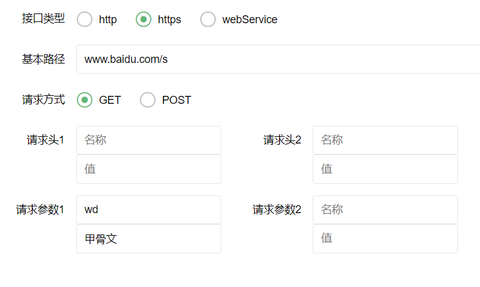

### Rest-Assured测试验证

#### Rest-Assured简介

Rest-Assured 是一个测试 RESTful Web Services 的 Java 类库。可以使用 Rest-Assured 编写高度自定义化的 HTTP 请求用来测试各种各样 Restful 服务组合的业务实现。

Rest-Assured 同样能够验证从服务器返回的 HTTP 响应报文，例如服务器响应状态码，响应报文内容等，Rest-Assured 可以灵活的用来进行 Restful Webservice 测试。

#### 使用方式和案例

1. **导入依赖**:在pom.xml ，添加使用 Rest-Assured 进行 Restful Webservice API 测试所需的依赖包

   ```xml
   <dependency>
       <groupId>io.rest-assured</groupId>
       <artifactId>rest-assured</artifactId>
       <version>3.3.0</version>
   </dependency>
   ```

2. 测试的 Restful WebService 因此需要添加域 JSON 相关的依赖包

   ```xml
   <dependency>
       <groupId>com.alibaba</groupId>
       <artifactId>fastjson</artifactId>
       <version>1.2.72</version>
   </dependency>
   ```

3. 拟定待测试的接口（控制器）——基本路径为：127.0.0.1:8080/devops

   ```java
   package com.trs.devopsdemo.controller;
   
   import com.trs.devopsdemo.domain.dto.DTO;
   import com.trs.devopsdemo.entity.JsonBean;
   import com.trs.devopsdemo.service.DevopsAutotestApiManagementService;
   import com.trs.devopsdemo.service.InterfaceService;
   import lombok.extern.slf4j.Slf4j;
   import org.springframework.beans.factory.annotation.Autowired;
   import org.springframework.web.bind.annotation.*;
   
   import javax.servlet.http.HttpServletRequest;
   
   /**
    * @Title TestController
    * @Description:
    * @Create Date: 2020/7/27 13:33
    * @Author Zhenjin.Zhang
    * @Contact: zhang.zhenjin@trs.com.cn
    * @Company: 成都拓尔思信息技术有限公司
    * @Department: 中台（Middle-End）
    */
   @Slf4j
   @RestController
   @RequestMapping("test")
   public class TestController {
   
       /**
        * HttpGet请求无参测试
        */
       @GetMapping("httpGet")
       public JsonBean httpGet() {
           return new JsonBean(0, "OK", null);
       }
       /**
        * HttpGet请求Query参数测试
        */
       @GetMapping("httpGetParams")
       public JsonBean httpGetParams(String username,String password){
           return new JsonBean(0,"OK",null);
       }
       /**
        * HttpGet请求Headers参数测试
        */
       @GetMapping("httpGetHeaders")
       public JsonBean httpGetParamsHeaders(String username, String password, HttpServletRequest request){
           return new JsonBean(0,"OK",request.getHeader("X-User-Token"));
       }
   
       /**
        * HttpPost请求Body参数测试
        */
       @PostMapping("httpPostBody")
       public JsonBean httpPostBody(@RequestBody DTO dto){
           return new JsonBean(0,"OK",dto);
       }
   
   }
   
   ```

4. 测试接口的返回

   ```java
   package com.trs.devopsdemo.entity;
   
   public class JsonBean {
   
   	// 状态码 0表示成功，-1表示失败，-999表示请求失败
   	private Integer code;
   	// 响应信息
   	private String msg;
   	// 数据对象
   	private Object data;
   
   	public JsonBean() {
   	}
   
   	public JsonBean(Integer code, String msg, Object data) {
   		this.code = code;
   		this.msg = msg;
   		this.data = data;
   	}
       //省略setter和getter方法
       
   }
   ```

5. 封装RestAssured的工具类

   ```java
   package com.trs.devopsdemo.utils;
   
   import io.restassured.response.Response;
   
   import java.net.MalformedURLException;
   import java.net.URL;
   import java.util.Map;
   import java.util.Objects;
   
   import static io.restassured.RestAssured.given;
   import static io.restassured.RestAssured.useRelaxedHTTPSValidation;
   
   public class RequestUtil {
   
       public static Response sendpostWithSoap(String surl,Map headers,String body) throws MalformedURLException {
           URL url = new URL(surl);
           headers.put("Content-Type","text/xml");
           return given().headers(headers)
                   .body(body)
                   .then().when()
                   .post(url);
       }
   
       public static Response sendpostWithHttp(String surl, Map headers, String dto) throws MalformedURLException {
           URL url = new URL(surl);
           Response response = given().
                   headers(headers).
                   body(dto).
                   then().
                   when().
                   post(url);
           return response;
       }
   
       public static Response sendgetWithHttp(String surl, Map params, Map headers) throws MalformedURLException {
           URL url = new URL(surl);
           if (isMapEmpty(params)){//无参请求
               if(isMapEmpty(headers)){//无headers
                   return given()
                           .when()
                           .get(surl);
               }
               //无参有headers
               return given()
                       .headers(headers)
                       .when()
                       .get(surl);
           }
           if(isMapEmpty(headers)){//有参数无headers
               return given()
                       .queryParams(params)
                       .when()
                       .get(surl);
           }
           return given()
                   .headers(headers)
                   .queryParams(params)
                   .when()
                   .get(surl);
       }
   
       public static Response sendpostWithHttps(String surl, Map headers, String body) throws Exception {
           URL url = new URL(surl);
           useRelaxedHTTPSValidation();
           Response response = given().
                   headers(headers).
                   body(body).
                   then().
                   when().
                   post(url);
           response.getBody().prettyPrint();
           return response;
       }
   
       public static Response sendgetWithHttps(String surl,Map headers, Map params) throws MalformedURLException {
           URL url = new URL(surl);
           useRelaxedHTTPSValidation();
           Response response = given()
                   .queryParams(params)
                   .headers(headers)
                   .when()
                   .get(url);
           return response;
       }
   
   
       private static boolean isMapEmpty(Map map) {
           return Objects.isNull(map) || map.size() == 0;
       }
   
   }
   ```
   
6. 自动化测试前后端（这里以layui搭建）

   前端：

   ```html
   <form class="layui-form" lay-filter="example">
   
       <div class="layui-form-item">
           <label class="layui-form-label">接口类型</label>
           <div class="layui-input-block">
               <input type="radio" name="agreement" value="http" title="http" checked="">
               <input type="radio" name="agreement" value="https" title="https">
               <input type="radio" name="agreement" value="webService" title="webService">
           </div>
       </div>
   
       <div class="layui-form-item">
           <label class="layui-form-label">基本路径</label>
           <div class="layui-input-block">
               <input type="text" name="url" lay-verify="title" autocomplete="off" placeholder="127.0.0.1:8080/devops/autotest/apiManagement/createGroup" class="layui-input">
           </div>
       </div>
       <div id="methodArea" class="layui-form-item">
           <label class="layui-form-label">请求方式</label>
           <div class="layui-input-block">
               <input type="radio" name="method" value="GET" title="GET" checked="">
               <input type="radio" name="method" value="POST" title="POST">
           </div>
       </div>
   
       <div class="layui-form-item">
           <label class="layui-form-label">请求头1</label>
           <div class="layui-input-inline">
               <input type="text" name="header1-name"  placeholder="名称" autocomplete="off" class="layui-input">
               <input type="text" name="header1-value"  placeholder="值" autocomplete="off" class="layui-input">
           </div>
           <label class="layui-form-label">请求头2</label>
           <div class="layui-input-inline">
               <input type="text" name="header2-name" placeholder="名称" autocomplete="off" class="layui-input">
               <input type="text" name="header2-value" placeholder="值" autocomplete="off" class="layui-input">
           </div>
       </div>
   
       <div class="layui-form-item">
           <label class="layui-form-label">请求参数1</label>
           <div class="layui-input-inline">
               <input type="text" name="param1-name"  placeholder="参数名" autocomplete="off" class="layui-input">
               <input type="text" name="param1-value"  placeholder="值" autocomplete="off" class="layui-input">
   
           </div>
           <label class="layui-form-label">请求参数2</label>
           <div class="layui-input-inline">
               <input type="text" name="param2-name" placeholder="名称" autocomplete="off" class="layui-input">
               <input type="text" name="param2-value" placeholder="值" autocomplete="off" class="layui-input">
           </div>
           <label class="layui-form-label">请求参数3</label>
           <div class="layui-input-inline">
               <input type="text" name="param3-name"  placeholder="名称" autocomplete="off" class="layui-input">
               <input type="text" name="param3-value"  placeholder="值" autocomplete="off" class="layui-input">
           </div>
           <label class="layui-form-label">请求参数4</label>
           <div class="layui-input-inline">
               <input type="text" name="param4-name" placeholder="名称" autocomplete="off" class="layui-input">
               <input type="text" name="param4-value" placeholder="值" autocomplete="off" class="layui-input">
           </div>
       </div>
       <div id="bodyArea" class="layui-form-item layui-form-text">
         <label class="layui-form-label">请求Body</label>
         <div class="layui-input-block">
           <textarea class="layui-textarea" name="body" lay-verify="content" id="LAY_demo_editor"></textarea>
         </div>
       </div>
   
       <div class="layui-form-item">
           <div class="layui-input-block">
               <button type="button" class="layui-btn layui-btn-normal" id="LAY-component-form-setval">赋值</button>
               <button type="button" class="layui-btn layui-btn-normal" id="LAY-component-form-getval">取值</button>
               <button type="button" lay-submit="" class="layui-btn" lay-filter="demo1">执行测试</button>
           </div>
       </div>
   </form>
   ```

   界面如下：

   

   后端：

   ```java
   package com.trs.devopsdemo.controller;
   
   import com.trs.devopsdemo.entity.JsonBean;
   import com.trs.devopsdemo.utils.RequestUtil;
   import io.restassured.RestAssured;
   import io.restassured.response.Response;
   import lombok.extern.slf4j.Slf4j;
   import org.springframework.beans.factory.annotation.Autowired;
   import org.springframework.util.StringUtils;
   import org.springframework.web.bind.annotation.*;
   
   import java.io.IOException;
   import java.net.MalformedURLException;
   import java.util.HashMap;
   import java.util.List;
   import java.util.Map;
   import java.util.Objects;
   
   /**
    * @Title AutotestController
    * @Description:
    * @Create Date: 2020/7/20 16:27
    * @Author Zhenjin.Zhang
    * @Contact: zhang.zhenjin@trs.com.cn
    * @Company: 成都拓尔思信息技术有限公司
    * @Department: 中台（Middle-End）
    */
   @Slf4j
   @RestController
   @RequestMapping("autotest")
   public class AutotestController {
   
       @PostMapping("restAssured")
       public JsonBean testRestAssured(@RequestBody Map map) {
           System.out.println(map.get("body").toString());
           String agreement = map.get("agreement").toString();
           String url = agreement + "://" + map.get("url");
           if ("webService".equals(agreement)) {
               url = "http://" + map.get("url").toString();
           }
           String param1Name = map.get("param1-name").toString();
           String param1Value = map.get("param1-value").toString();
           String param2Name = map.get("param2-name").toString();
           String param2Value = map.get("param2-value").toString();
           String param3Name = map.get("param3-name").toString();
           String param3Value = map.get("param3-value").toString();
           String param4Name = map.get("param4-name").toString();
           String param4Value = map.get("param4-value").toString();
   
           Map params = new HashMap();
           params = this.putKeyValue(params, param1Name, param1Value);
           params = this.putKeyValue(params, param2Name, param2Value);
           params = this.putKeyValue(params, param3Name, param3Value);
           params = this.putKeyValue(params, param4Name, param4Value);
   
           String header1Name = map.get("header1-name").toString();
           String header1Value = map.get("header1-value").toString();
           String header2Name = map.get("header2-name").toString();
           String header2Value = map.get("header2-value").toString();
           Map headers = new HashMap();
           headers = this.putKeyValue(headers, header1Name, header1Value);
           headers = this.putKeyValue(headers, header2Name, header2Value);
   
           Response response = null;
   
           if("GET".equals(map.get("method").toString()) &&"https".equals(map.get("agreement").toString())){
               //https get请求
               try {
                   response = RequestUtil.sendgetWithHttps(url, headers, params);
               } catch (MalformedURLException e) {
                   e.printStackTrace();
               }
           }
           if ("GET".equals(map.get("method").toString()) && "http".equals(map.get("agreement").toString())) {
               //http协议 get请求 无参数
               try {
                   response = RequestUtil.sendgetWithHttp(url, params, headers);
                   log.warn("连接超时异常");
               } catch (Exception e) {
                   e.printStackTrace();
               }
           }
           if ("POST".equals(map.get("method").toString()) && "http".equals(map.get("agreement").toString())) {
               //http协议 get请求 无参数
               try {
                   response = RequestUtil.sendpostWithHttp(url, headers, map.get("body").toString());
               } catch (Exception e) {
                   e.printStackTrace();
                   log.warn("连接超时异常");
               }
           }
           HashMap<Object, Object> resMap = new HashMap<>();
           if ("webService".equals(map.get("agreement").toString())) {
               //soap
               try {
                   response = RequestUtil.sendpostWithSoap(url, headers, map.get("body").toString());
                   resMap.put("xml",response.xmlPath().prettyPrint());
               } catch (MalformedURLException e) {
                   e.printStackTrace();
               }
           }
   
           resMap.put("body", response.getBody().toString());
           resMap.put("headers", response.getHeaders().toString());
           resMap.put("time", response.getTime());
           return new JsonBean(0, "OK", resMap.toString());
       }
   
       private Map putKeyValue(Map map, String key, String value) {
           if (!StringUtils.isEmpty(key) && !StringUtils.isEmpty(value)) {
               map.put(key, value);
           }
           return map;
       }
   }
   ```

#### Http协议请求测试 

##### 1.GET请求

- **无参数测试**

  **待测接口信息**

  ```json
  {
      "路径":"127.0.0.1:8080/devops/test/httpGet",
      "请求方式":"GET",
      "返回体":"json格式"
  }
  ```

  

  **正常测试返回**

  ```wiki
  HTTP/1.1 200 
  Content-Type: application/json;charset=UTF-8
  Transfer-Encoding: chunked
  Date: Mon, 27 Jul 2020 06:38:43 GMT
  Keep-Alive: timeout=60
  Connection: keep-alive
  
  {
      "code": 0,
      "msg": "OK",
      "data": null
  }
  ```

  **服务器连接异常**

  ```wiki
  java.net.ConnectException: Connection refused: connect
  ```

  **路径不存在返回**

  ```wiki
  HTTP/1.1 404 
  Content-Type: application/json;charset=UTF-8
  Transfer-Encoding: chunked
  Date: Mon, 27 Jul 2020 06:41:17 GMT
  Keep-Alive: timeout=60
  Connection: keep-alive
  
  {
      "timestamp": "2020-07-27T06:41:17.463+0000",
      "status": 404,
      "error": "Not Found",
      "message": "No message available",
      "path": "/devops/test/httpXXX"
  }
  ```

- **Query参数测试**

  **待测接口信息**

  ```json
  {
      "路径":"127.0.0.1:8080/devops/test/httpGetParams",
      "请求方式":"GET",
      "返回体":"json格式",
      "请求参数":"username=zs,password=123"
  }
  ```

  

  **测试结果**

  ```
  可行
  ```

- **请求头参数测试**

  **待测接口信息**

  ```json
  {
      "路径":"127.0.0.1:8080/devops/test/httpGetHeaders",
      "请求方式":"GET",
      "返回体":"json格式",
      "请求头":"X-User-Token=zs,Content-Type=application/json",
  }
  ```

  **测试结果**

  ```wiki
  Request method:	GET
  Request URI:	http://127.0.0.1:8080/devops/test/httpGetHeaders?password=123456&username=zs
  Query params:	password=123456
  				username=zs
  Headers:		X-User-Token=dw1q123da3sa4x
  				Accept=*/*
  				Content-Type=application/json; charset=UTF-8
  {
      "code": 0,
      "msg": "OK",
      "data": null
  }
  ```

##### 2.POST请求

- **请求Body测试**

  **接口信息**

  ```json
  {
      "路径":"127.0.0.1:8080/devops/test/httpPostBody",
      "请求方式":"POST",
      "返回体":"json格式",
      "请求Body":"{"title":"hello","num":"1"}"
  }
  ```

  

  **返回信息**
  
  ```wiki
  Request method:	POST
  Request URI:	http://127.0.0.1:8080/devops/test/httpPostBody
  Proxy:			<none>
  Request params:	<none>
  Query params:	<none>
  Form params:	<none>
  Path params:	<none>
  Headers:		X-User-Token=dw232dewf3rg34g
  				Accept=*/*
  				Content-Type=application/json; charset=UTF-8
  Cookies:		<none>
  Multiparts:		<none>
  Body:
  {
      "title": "hello",
      "num": "1"
  }
  {
      "code": 0,
      "msg": "OK",
      "data": {
          "title": "hello",
          "num": 1
      }
  }
```

#### WebService简介

- WebService采用Http协议来在客户端和服务端之间传输数据。WebService使用XML来封装数据，XML主要的优点在于它是跨平台的。
- WebService通过HTTP协议发送请求和接收结果时，发送的请求内容和结果内容都采用XML格式封装，并增加了一些特定的HTTP消息头，以说明HTTP消息的内容格式，这些特定的HTTP消息头和XML内容格式就是SOAP协议规定的。
- WebService服务器端首先要通过一个WSDL文件来说明自己有什么服务可以对外调用。简单的说，WSDL就像是一个说明书，用于描述WebService及其方法、参数和返回值。 WSDL文件保存在Web服务器上，通过一个url地址就可以访问到它。客户端要调用一个WebService服务之前，要知道该服务的WSDL文件的地址。WebService服务提供商可以通过两种方式来暴露它的WSDL文件地址：1.注册到UDDI服务器，以便被人查找；2.直接告诉给客户端调用者。

 **WebService交互的过程就是,WebService遵循SOAP协议通过XML封装数据，然后由Http协议来传输数据。本质为http-post请求**

#### WebService程序搭建

- 新建springboot工程-- https://github.com/yaojiqunaer/soapdemo 

-  定义一个webservice接口和实现类，使用@WebService注解标明是一个webservice服务。 

  ```java
  package com.trs.soapdemo.service;
  import javax.jws.WebService;
  @WebService
  public interface GreetWebService {
      @WebMethod
      String greeting(String hello);
  }
  
  
  package com.trs.soapdemo.service.impl;
  import com.trs.soapdemo.service.GreetWebService;
  import javax.jws.WebService;
  @WebService
  public class GreetWebServiceImpl implements GreetWebService {
  
      @WebMethod
      @Override
      public String greeting(String hello) {
          return "Good Morning:" + hello;
      }
  }
  ```

- 定义的一个bean，这个的意思就是当容器执行完成的时候会去加载run方法的内容

  ```java
  package com.trs.soapdemo.service;
  import com.trs.soapdemo.service.impl.GreetWebServiceImpl;
  import org.springframework.beans.factory.annotation.Value;
  import org.springframework.boot.ApplicationArguments;
  import org.springframework.boot.ApplicationRunner;
  import org.springframework.stereotype.Component;
  import javax.xml.ws.Endpoint;
  @Component
  public class MyListener implements ApplicationRunner {
      @Value("${webservice.path}")
      private String path;
      @Override
      public void run(ApplicationArguments args) throws Exception {
          System.out.println("发布地址:"+path);
          Endpoint.publish(path, new GreetWebServiceImpl());
          System.out.println("发布成功");
      }
  }
  ```

- 在application.properties中配置上要发布的地址

  ```properties
  webservice.path=http://127.0.0.1:9090/greet
  ```

- 启动程序，浏览器访问http://127.0.0.1:9090/greet?wsdl，注意wsdl必须加上，出现XML页面表示发布成功

- 使用postman测试接口，请求头设置为Content-Type=text/xml，请求体为

  ```xml
  <?xml version="1.0" encoding="utf-8"?>
  <soap:Envelope xmlns:soap="http://schemas.xmlsoap.org/soap/envelope/" xmlns:xsi="http://www.w3.org/2001/XMLSchema-instance" xmlns:xsd="http://www.w3.org/2001/XMLSchema">
      <soap:Body>
          <greeting  xmlns="http://impl.service.soapdemo.trs.com/">
          	<hello>张三</hello>
          </greeting>
      </soap:Body>
  </soap:Envelope>
  ```

- 响应结果

  ```xml
  <?xml version="1.0" ?>
  <S:Envelope xmlns:S="http://schemas.xmlsoap.org/soap/envelope/">
      <S:Body>
          <ns2:greetingResponse xmlns:ns2="http://impl.service.soapdemo.trs.com/">
              <return>Good Morning:null</return>
          </ns2:greetingResponse>
      </S:Body>
  </S:Envelope>
  ```

#### Soap协议简介

SOAP即简单对象访问协议，他是使用http发送的XML格式的数据，它可以跨平台，跨防火墙，SOAP不是webservice的专有协议。

SOAP=http+xml

SOAP结构

```
必需的 Envelope 元素，可把此 XML 文档标识为一条 SOAP 消息
可选的 Header 元素，包含头部信息
必需的 Body 元素，包含所有的调用和响应信息
可选的 Fault 元素，提供有关在处理此消息所发生错误的信息
```

#### Soap协议请求测试

- **接口信息**

  ```json
  {
      "路径":"localhost:9090/greet?wsdl",
      "请求方式":"POST",
      "协议":"soap"
      "请求Body":"<?xml version="1.0" encoding="utf-8"?>
              <soap:Envelope xmlns:soap="http://schemas.xmlsoap.org/soap/envelope/" xmlns:xsi="http://www.w3.org/2001/XMLSchema-instance" xmlns:xsd="http://www.w3.org/2001/XMLSchema">
              <soap:Body>
              <greeting xmlns="http://impl.service.soapdemo.trs.com/">
              <hello>张三</hello>
               </greeting>
              </soap:Body>
              </soap:Envelope>",
      "返回信息":"<?xml version="1.0" encoding="UTF-8"?><S:Envelope xmlns:S="http://schemas.xmlsoap.org/soap/envelope/">
                    <S:Body>
                      <ns2:greetingResponse xmlns:ns2="http://impl.service.soapdemo.trs.com/">
                        <return>Good Morning:null</return>
                      </ns2:greetingResponse>
                    </S:Body>
                  </S:Envelope>"
  }
  ```

  

- 返回信息

  ```
  
  ```

  

#### Https请求测试

- 测试接口

  ```json
  {
  	"描述":"测试百度搜索(百度防爬虫需加两个请求头参数)",
      "路径":"www.baidu.com/s",
      "请求方式":"GET",
      "请求参数":"wd=甲骨文",
      "请求头1":"Accept=text/html,application/xhtml+xml,application/xml;q=0.9,image/webp,image/apng,*/*;q=0.8",
      "请求头2":"User-Agent=Mozilla/5.0 (Windows NT 10.0; WOW64) AppleWebKit/537.36 (KHTML, like Gecko) Chrome/70.0.3538.25 Safari/537.36 Core/1.70.3775.400 QQBrowser/10.6.4208.400",
    "协议":"https"
  }
```
  
  

- 响应结果

  整个搜索页面的HTML文档